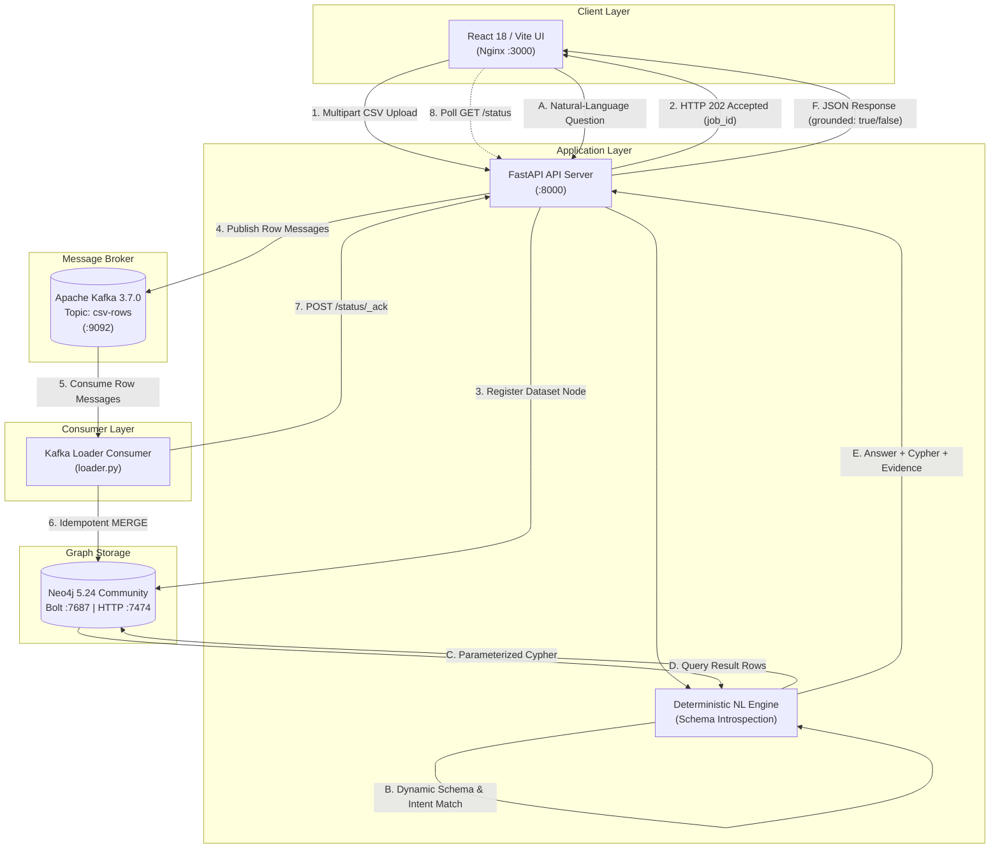
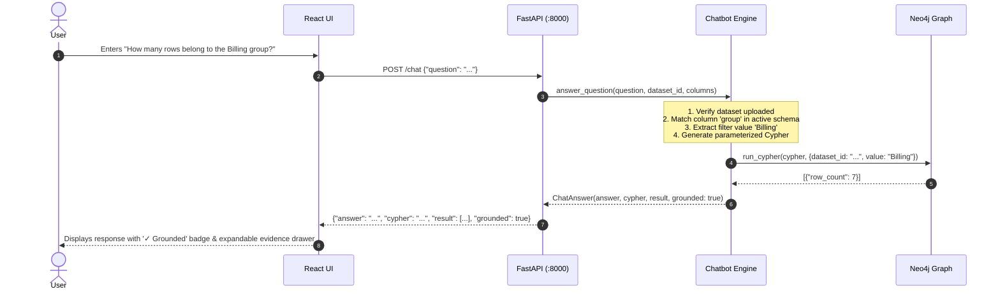
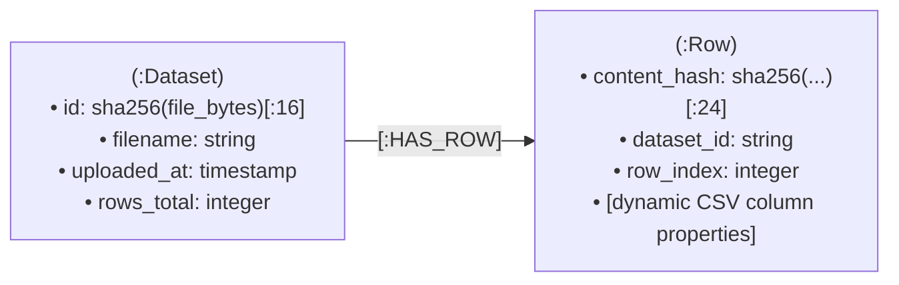
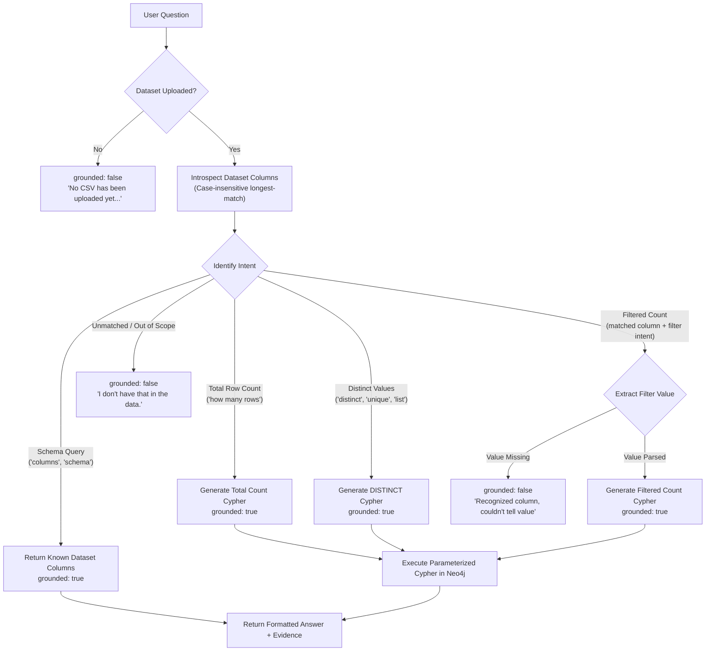

# Data In, Answers Out
### CSV → Kafka → Neo4j Grounded Natural-Language Chatbot

[](#testing)
[](https://www.python.org/)
[](https://fastapi.tiangolo.com/)
[-black.svg)](https://kafka.apache.org/)
[](https://neo4j.com/)
[-61DAFB.svg)](https://react.dev/)
[](#docker-architecture)

> An asynchronous, event-driven data pipeline and deterministic natural-language question-answering system. A user uploads an unknown CSV through a web interface, rows stream through Apache Kafka into a Neo4j graph database, and users ask natural-language questions that are deterministically translated into Cypher queries with strict data grounding.

---

## Table of Contents

- [Project Overview](#project-overview)
- [Design Philosophy](#design-philosophy)
- [Key Features](#key-features)
- [Architecture](#architecture)
- [Service Responsibilities](#service-responsibilities)
- [End-to-End Data Flow](#end-to-end-data-flow)
- [Technology Stack](#technology-stack)
- [Project Structure](#project-structure)
- [Graph Data Model](#graph-data-model)
- [Idempotency & Content Hashing](#idempotency--content-hashing)
- [Deterministic Natural-Language Chatbot](#deterministic-natural-language-chatbot)
- [Chatbot Capabilities](#chatbot-capabilities)
- [Dynamic Schema Support](#dynamic-schema-support)
- [Strict Grounding & Hallucination Prevention](#strict-grounding--hallucination-prevention)
- [Security & Parameterized Cypher](#security--parameterized-cypher)
- [API Documentation](#api-documentation)
- [Docker Architecture & Hardening](#docker-architecture--hardening)
- [Getting Started](#getting-started)
- [Application URLs](#application-urls)
- [User Interface Walkthrough](#user-interface-walkthrough)
- [Example End-to-End Walkthrough](#example-end-to-end-walkthrough)
- [Testing & Quality Assurance](#testing--quality-assurance)
- [Edge Cases & Error Handling](#edge-cases--error-handling)
- [Limitations & Production Readiness](#limitations--production-readiness)
- [Hackathon Compliance Matrix](#hackathon-compliance-matrix)

---

## Project Overview

Modern enterprise data architectures require decoupling data ingestion from graph storage while offering non-technical users intuitive access to database insights.

**Data In, Answers Out** implements this pipeline end-to-end:
1. **Dynamic CSV Ingestion**: Users upload arbitrary CSV files via a modern React web interface without requiring predefined database schemas.
2. **Asynchronous Ingestion Decoupling**: The FastAPI application immediately returns an HTTP `202 Accepted` response, parsing rows and publishing each row as an individual event to Apache Kafka topic `csv-rows`. The upload handler never blocks on database writes.
3. **Event Streaming**: Apache Kafka (running in standalone KRaft mode without ZooKeeper) buffers row events.
4. **Idempotent Graph Loading**: An asynchronous consumer loader pulls row events from Kafka and executes idempotent `MERGE` operations in Neo4j, acknowledging commit status back to the API.
5. **Grounded Natural-Language Chatbot**: Users submit plain-English questions. The query engine uses deterministic pattern parsing and dynamic schema introspection to translate queries into Cypher, query Neo4j, and return verified answers alongside executed Cypher and raw result payloads.
6. **Zero Hallucination by Construction**: The chatbot is **deterministic, not LLM-based**. It requires no external AI APIs, eliminates model drift, and explicitly refuses unsupported questions (`"I don't have that in the data."`) rather than fabricating answers.

---

## Design Philosophy

### Why Deterministic Natural-Language Parsing Instead of an LLM?

This project makes a deliberate architectural tradeoff: **predictability and auditability over conversational open-endedness**.

```
┌───────────────────────────────────────────────┐
│              Design Decision                  │
├───────────────────────┬───────────────────────┤
│   LLM Text-to-Cypher  │  Deterministic Engine │
├───────────────────────┼───────────────────────┤
│ ❌ Hallucination risk │ ✅ 100% Grounded      │
│ ❌ External API / key │ ✅ Self-contained     │
│ ❌ Non-deterministic  │ ✅ Fully reproducible │
│ ❌ Cost per question  │ ✅ Sub-millisecond    │
│ ❌ Unsafe injections  │ ✅ Parameterized/Safe │
└───────────────────────┴───────────────────────┘
```

By relying on deterministic intent extraction, regex pattern matching, and dynamic schema introspection:
- **Grounding is structural**: If a user asks about a column that does not exist in the uploaded dataset, the parser rejects it before touching the database.
- **Answers are verifiable**: Every response includes the executed Cypher query and the exact database rows returned by Neo4j.
- **Safety is enforced**: User inputs are bound strictly as Cypher query parameters, and column identifiers are validated against known dataset headers.

---

## Key Features

- **Drag-and-Drop Ingestion**: Upload CSV files with immediate client feedback and file-size detection.
- **Hostile Input Resilience**: Validated against empty files (0 bytes), header-only files, binary non-CSV files, and ragged rows with missing/extra cells.
- **Non-Blocking Upload Handler**: `POST /ingest` returns `202 Accepted` immediately upon parsing and queuing.
- **Row-Level Event Streaming**: Every CSV row is serialized as a distinct message on Kafka topic `csv-rows`.
- **KRaft Single-Broker Kafka**: Operates modern Kafka 3.7.0 in KRaft controller/broker mode without ZooKeeper.
- **Content-Sensitive Idempotency**: Dataset IDs use SHA-256 hashes of raw file bytes; Row nodes use SHA-256 hashes of canonicalized row values. Re-uploading identical data creates **zero duplicate nodes or relationships**.
- **Accurate Status Accounting**: The loader reports row status (`/status/_ack`) only after Neo4j write transactions commit, ensuring `/status` never lies about ingestion progress.
- **Live Health Diagnostics**: `/health` verifies active broker discovery in Kafka and performs real write/read/delete canary transactions in Neo4j.
- **Dynamic Schema Resolution**: Seamlessly adapts to any CSV schema (e.g., customer orders, employee records, product inventory).
- **Interactive Grounded Chatbot**: Translates natural-language questions to Cypher for row counts, filtered counts, distinct values, and column listings.
- **Expandable Evidence Drawer**: Transparently displays grounded state, executed Cypher, and raw database payloads in the UI.
- **Hardened Multi-Stage Containers**: All containers run unprivileged (`appuser` for Python, `nginx` uid 101 with `libcap` capability binding for port 80).

---

## Architecture

The system comprises two decoupled operational flows: **Ingestion** (asynchronous write path) and **Query** (synchronous read path).



---

## Service Responsibilities

All services are orchestrated via `docker-compose.yml`:

| Service | Container Name | Base Image | Port | Responsibility |
|---|---|---|---|---|
| **`ui`** | `csv_ui` | `nginx:1.27-alpine` (multi-stage) | `3000:80` | Production React SPA, drag-and-drop CSV upload, live progress tracking, chat UI, evidence drawer |
| **`api`** | `csv_api` | `python:3.11-slim` | `8000:8000` | FastAPI server: CSV validation/parsing, Kafka producer, `/status` job tracking, `/health`, chatbot endpoint |
| **`kafka`** | `csv_kafka` | `apache/kafka:3.7.0` | `9092:9092` | Event broker running in KRaft mode, persists and buffers `csv-rows` event topic |
| **`loader`** | `csv_loader` | `python:3.11-slim` | *internal* | Consumes `csv-rows`, executes idempotent Cypher `MERGE` in Neo4j, acknowledges committed rows to API |
| **`neo4j`** | `csv_neo4j` | `neo4j:5.24-community` | `7474:7474`<br/>`7687:7687` | Graph database storing `Dataset` and `Row` nodes connected via `HAS_ROW` relationships |

---

## End-to-End Data Flow

### 1. Ingestion Sequence

```mermaid
sequenceDiagram
    autonumber
    actor User
    participant UI as React UI
    participant API as FastAPI (:8000)
    participant Kafka as Kafka (csv-rows)
    participant Loader as Kafka Loader
    participant Neo4j as Neo4j Graph

    User->>UI: Selects & uploads CSV file
    UI->>API: POST /ingest (multipart/form-data)
    Note over API: Validates file, derives dataset_id,<br/>parses rows & content hashes
    API->>Neo4j: MERGE (d:Dataset {id: dataset_id})
    loop For each CSV row
        API->>Kafka: send(topic="csv-rows", key=content_hash, value=row_payload)
    end
    API-->>UI: 202 Accepted {job_id, rows_received, status: "queued"}
    
    loop Polling Ingestion Status
        UI->>API: GET /status?job_id=xxx
        API-->>UI: {status: "loading", rows_loaded, rows_total}
    end

    loop Consumer Ingestion Loop
        Kafka->>Loader: Fetch row message
        Loader->>Neo4j: MERGE (r:Row {content_hash}) + MERGE (d)-[:HAS_ROW]->(r)
        Loader->>API: POST /status/_ack {job_id, succeeded: true}
        Note over API: Increment rows_loaded;<br/>mark "complete" when all rows acked
    end

    UI->>API: GET /status?job_id=xxx
    API-->>UI: {status: "complete", rows_loaded: N, rows_total: N}
    Note over UI: Progress bar reaches 100%,<br/>Chatbot unlocked for questions
```

### 2. Query Sequence



---

## Technology Stack

| Technology | Version | Purpose |
|---|---|---|
| **Python** | `3.11-slim` (runtime) / `3.13` (local tests) | Backend execution environment |
| **FastAPI** | `0.111.0` | Asynchronous REST API framework |
| **Uvicorn** | `0.30.1` | ASGI web server |
| **Apache Kafka** | `3.7.0` | Event bus running in standalone KRaft mode |
| **kafka-python** | `2.0.2` | Python Kafka producer and consumer clients |
| **Neo4j** | `5.24-community` | Graph database and Cypher query execution engine |
| **neo4j-python-driver** | `5.24.0` | Official Neo4j Bolt driver |
| **React** | `18.3.1` | Modern frontend UI framework |
| **Vite** | `5.4.2` | Frontend build tool and bundler |
| **Nginx** | `1.27-alpine` | Production reverse proxy and static asset server |
| **pytest** | `9.1.1` | Test runner for unit and integration testing |
| **Docker Compose** | Specification `3.9` | Multi-container orchestration |

---

## Project Structure

```
NerualCrew02/
├── .env.example              # Template environment variables (NEO4J credentials)
├── .gitignore                # Git ignore patterns
├── README.md                 # Primary documentation
├── REPORT.md                 # Technical report and live verification log
├── docker-compose.yml        # Orchestration for all 5 services with healthchecks
├── api/                      # FastAPI service
│   ├── Dockerfile            # Python 3.11-slim non-root image (appuser)
│   ├── requirements.txt      # API dependencies (fastapi, kafka-python, neo4j, etc.)
│   └── app/
│       ├── __init__.py
│       ├── chatbot.py        # Grounded Cypher generation and natural-language parser
│       ├── csv_utils.py      # Deterministic hashing, hostile-input parsing
│       ├── kafka_client.py   # KafkaProducer wrapper with retry-on-startup logic
│       ├── main.py           # FastAPI routes (/ingest, /status, /chat, /health)
│       ├── models.py         # IngestResponse, StatusResponse, ChatResponse dataclasses
│       └── neo4j_client.py   # Neo4jClient wrapper with live canary transaction checks
├── loader/                   # Kafka consumer service
│   ├── Dockerfile            # Python 3.11-slim non-root image (appuser)
│   ├── requirements.txt      # Consumer dependencies (kafka-python, neo4j, requests)
│   └── loader.py             # Stream consumer, idempotent MERGE, commit-ack caller
├── ui/                       # React + Vite frontend
│   ├── Dockerfile            # Multi-stage build (Node 20 -> Nginx 1.27 non-root)
│   ├── index.html            # Application entry HTML
│   ├── package.json          # Node dependencies (React 18, Vite 5)
│   ├── vite.config.js        # Vite build configuration
│   └── src/
│       ├── App.jsx           # Main UI: upload dropzone, progress bar, chat & evidence
│       ├── index.css         # Modern dark-mode UI stylesheet
│       └── main.jsx          # React DOM root mounting
├── data/                     # Ingestion and hostile-input fixtures
│   ├── empty.csv             # 0-byte file (400 EmptyCSVError test)
│   ├── header_only.csv       # Header with 0 rows (400 NoDataRowsError test)
│   ├── not_a_csv.png         # Binary PNG bytes (400 NotACSVError test)
│   ├── sample_broken.csv     # Ragged columns & blank lines (tolerated)
│   ├── sample_clean.csv      # 15 clean test records (customer orders)
│   └── sample_large.csv      # 5,000 generated records for volume testing
├── scripts/
│   └── smoke_test.py         # End-to-end integration transcript script
└── tests/                    # 29 automated tests (100% passing)
    ├── test_api.py           # 14 tests: HTTP status codes, Kafka/Neo4j fakes, health
    ├── test_chatbot.py       # 6 tests: Cypher queries, grounding, non-existent columns
    └── test_csv_utils.py     # 9 tests: Parsing, hashing, hostile inputs
```

---

## Graph Data Model

The graph model represents datasets and their rows generically, accommodating arbitrary CSV schemas:



### Node Specifications

1. **`Dataset` Node**:
   - **`id`** (`String`): 16-character SHA-256 hex digest computed directly from the uploaded file's raw bytes.
   - **`filename`** (`String`): Name of the uploaded file.
   - **`uploaded_at`** (`Integer`): Epoch millisecond timestamp when the upload was registered.
   - **`rows_total`** (`Integer`): Total count of valid data rows in the file.

2. **`Row` Node**:
   - **`content_hash`** (`String`): 24-character SHA-256 digest of the canonicalized row values. Serves as the primary unique key for `MERGE`.
   - **`dataset_id`** (`String`): Identifier of the parent dataset.
   - **`row_index`** (`Integer`): Zero-indexed position of the row within the original CSV.
   - **Dynamic Column Properties**: Each CSV column name becomes a node property storing the row's string cell value (e.g., `customer_id`, `name`, `group`, `order_id`, `amount`).

3. **`HAS_ROW` Relationship**:
   - Directed relationship from `Dataset` to `Row` (`(:Dataset)-[:HAS_ROW]->(:Row)`).

---

## Idempotency & Content Hashing

A core requirement is that uploading the exact same CSV multiple times must **never create duplicate nodes or relationships**.

### The Two-Tier Hashing Strategy

1. **Deterministic Dataset ID**:
   ```python
   def dataset_id_for_bytes(raw: bytes) -> str:
       return hashlib.sha256(raw).hexdigest()[:16]
   ```
   Instead of assigning random UUIDs, the dataset ID is a cryptographic hash of the file bytes. The same file yields the same `dataset_id` across restarts, machines, and sessions.

2. **Content-Sensitive Row Hash**:
   ```python
   def row_content_hash(dataset_id: str, values: dict) -> str:
       canonical = dataset_id + "|" + "|".join(
           f"{k}={values[k]}" for k in sorted(values.keys())
       )
       return hashlib.sha256(canonical.encode("utf-8")).hexdigest()[:24]
   ```
   Rather than keying rows on `(dataset_id, row_index)` (which could fail if line breaks shift), rows are keyed on the SHA-256 hash of their sorted key-value pairs.

3. **Cypher `MERGE` Execution**:
   ```cypher
   MATCH (d:Dataset {id: $dataset_id})
   MERGE (r:Row {content_hash: $content_hash})
   SET r.dataset_id = $dataset_id,
       r.row_index = $row_index,
       r += $values
   MERGE (d)-[:HAS_ROW]->(r)
   ```
   If a row message is redelivered via Kafka replay or the user re-uploads the file, Neo4j matches the existing `content_hash` node and existing `HAS_ROW` edge, keeping node counts identical.

---

## Deterministic Natural-Language Chatbot

The chatbot transforms plain-English questions into valid, executed Cypher queries using a deterministic parsing engine (`api/app/chatbot.py`).



---

## Chatbot Capabilities

The chatbot supports a well-defined set of natural-language inquiry patterns:

### 1. Total Row Count
- **Question Examples**:
  - *"How many rows are there?"*
  - *"What is the total row count?"*
- **Generated Cypher**:
  ```cypher
  MATCH (d:Dataset {id: $dataset_id})-[:HAS_ROW]->(r:Row)
  RETURN count(r) AS row_count
  ```
- **Response**: `"There are 15 rows in this dataset."` (`grounded: true`)

### 2. Filtered Count by Column Value
- **Question Examples**:
  - *"How many rows belong to the Billing group?"*
  - *"How many rows have group = 'Sales'?"*
  - *"How many rows have group = Support?"*
- **Extraction Rules**:
  - Quoted tokens: `'Billing'`
  - Equality expressions: `group = Sales`, `group is Support`
  - Adjacent tokens: `...the Billing group` (resolves `Billing` for column `group`)
- **Generated Cypher**:
  ```cypher
  MATCH (d:Dataset {id: $dataset_id})-[:HAS_ROW]->(r:Row)
  WHERE r.`group` = $value
  RETURN count(r) AS row_count
  ```
- **Parameters**: `{"dataset_id": "...", "value": "Billing"}`
- **Response**: `"There are 7 rows where group = 'Billing'."` (`grounded: true`)

### 3. Distinct Values of a Column
- **Question Examples**:
  - *"What are the distinct values of group?"*
  - *"What unique groups exist?"*
  - *"List distinct group"*
- **Generated Cypher**:
  ```cypher
  MATCH (d:Dataset {id: $dataset_id})-[:HAS_ROW]->(r:Row)
  RETURN DISTINCT r.`group` AS value LIMIT 25
  ```
- **Response**: `"Distinct values of group: Sales, Billing, Support."` (`grounded: true`)

### 4. Schema and Column Discovery
- **Question Examples**:
  - *"What columns does this data have?"*
  - *"Show me the schema"*
  - *"What fields are in this dataset?"*
- **Generated Cypher**: `// no query needed -- columns are known from the ingest step`
- **Response**: `"This dataset has these columns: customer_id, name, group, order_id, amount."` (`grounded: true`)

### 5. Honest Rejection of Unsupported Inquiries
- **Filter with Nonexistent Column**:
  - Question: *"How many rows have status = 'Approved'?"*
  - Response: `"I don't have that in the data. None of the columns in this dataset match what you're asking about. Available columns: customer_id, name, group, order_id, amount."` (`grounded: false`)
- **General Knowledge**:
  - Question: *"What is the capital of France?"*
  - Response: `"I don't have that in the data. Try asking about row counts, or about one of these columns..."` (`grounded: false`)
- **Unimplemented Numeric Aggregates (AVG/SUM/MIN/MAX)**:
  - Question: *"What is the average amount?"*
  - Response: `"I don't have that in the data. Try asking about row counts, or about one of these columns..."` (`grounded: false`)

---

## Dynamic Schema Support

The pipeline is **schema-agnostic**. It does not hardcode schemas for customer orders or specific column names.

When an arbitrary CSV is ingested, the system reads the header row and uses it dynamically:
- **Employee Directory** (`employee_id, department, title, salary`):
  - *"What departments exist?"* → Finds distinct values for `department`.
  - *"How many rows belong to Engineering department?"* → Counts rows where `department = 'Engineering'`.
- **Product Inventory** (`sku, category, warehouse, stock`):
  - *"What columns are in this data?"* → Lists `sku, category, warehouse, stock`.
  - *"How many rows have category = Electronics?"* → Counts rows where `category = 'Electronics'`.

---

## Strict Grounding & Hallucination Prevention

A response is considered **grounded** only when it can be directly verified against the graph data loaded in Neo4j.

```
                  Question Received
                          │
          Does an uploaded dataset exist?
                   ├── No  ──► [grounded: false] "No CSV has been uploaded yet..."
                   └── Yes
                          │
     Are referenced columns in the uploaded schema?
                   ├── No  ──► [grounded: false] "None of the columns match..."
                   └── Yes
                          │
       Does the intent match a supported query?
                   ├── No  ──► [grounded: false] "I don't have that in the data."
                   └── Yes
                          │
                  Execute Cypher
                          │
          Return Answer + Raw Result + Cypher
                     [grounded: true]
```

---

## Security & Parameterized Cypher

To prevent Cypher injection vulnerabilities:
1. **Parameterized User Values**: User-provided filter values are never concatenated directly into Cypher strings. They are passed strictly via Cypher parameter maps (`$value`, `$dataset_id`).
2. **Schema-Validated Identifiers**: Column names cannot be passed as Cypher parameters in Neo4j, so they are injected via escaped backticks (``r.`{col}```). The parser guarantees that `{col}` is chosen **strictly from the validated list of headers** extracted during ingestion.
3. **No Direct Cypher Passthrough**: Users cannot execute arbitrary Cypher strings via the API; all queries are synthesized by the backend.

---

## API Documentation

The FastAPI application provides four primary endpoints:

### 1. `POST /ingest`
Uploads a CSV file, parses rows, creates the `Dataset` node, and queues row events to Kafka.

- **Request**: `multipart/form-data`
  - `file`: The CSV file.
- **Status Code**: `202 Accepted`
- **Example**:
  ```bash
  curl -X POST -F "file=@data/sample_clean.csv" http://localhost:8000/ingest
  ```
- **Response**:
  ```json
  {
    "job_id": "4a1b8c2d",
    "rows_received": 15,
    "status": "queued"
  }
  ```

### 2. `GET /status`
Returns the real-time ingestion progress for an upload job.

- **Query Parameters**: `job_id` (string)
- **Status Code**: `200 OK` (or `404 Not Found` if job does not exist)
- **Example**:
  ```bash
  curl "http://localhost:8000/status?job_id=4a1b8c2d"
  ```
- **Response**:
  ```json
  {
    "job_id": "4a1b8c2d",
    "status": "complete",
    "rows_total": 15,
    "rows_loaded": 15,
    "rows_failed": 0
  }
  ```
  *(Status transitions: `queued` → `loading` → `complete` | `failed`)*

### 3. `POST /chat`
Accepts a natural-language question and returns a grounded answer.

- **Request Body**: `application/json`
  ```json
  {
    "question": "How many rows belong to the Billing group?"
  }
  ```
- **Status Code**: `200 OK`
- **Example**:
  ```bash
  curl -X POST http://localhost:8000/chat \
    -H "Content-Type: application/json" \
    -d '{"question": "How many rows belong to the Billing group?"}'
  ```
- **Response**:
  ```json
  {
    "answer": "There are 7 rows where group = 'Billing'.",
    "cypher": "MATCH (d:Dataset {id: $dataset_id})-[:HAS_ROW]->(r:Row) WHERE r.`group` = $value RETURN count(r) AS row_count",
    "result": [
      {
        "row_count": 7
      }
    ],
    "grounded": true
  }
  ```

### 4. `GET /health`
Returns live connectivity health for both Kafka and Neo4j.

- **Status Code**: `200 OK`
- **Example**:
  ```bash
  curl http://localhost:8000/health
  ```
- **Response**:
  ```json
  {
    "status": "ok",
    "kafka_connected": true,
    "neo4j_connected": true
  }
  ```

---

## Docker Architecture & Hardening

The multi-container stack enforces container best practices and startup ordering:

```
                  ┌───────────────────────┐
                  │    docker compose     │
                  └──────────┬────────────┘
                             │
            ┌────────────────┴────────────────┐
            ▼                                 ▼
   ┌─────────────────┐               ┌─────────────────┐
   │      kafka      │               │      neo4j      │
   │  (apache/kafka) │               │(neo4j-community)│
   └────────┬────────┘               └────────┬────────┘
            │ service_healthy                 │ service_healthy
            └────────────────┬────────────────┘
                             ▼
                    ┌─────────────────┐
                    │       api       │
                    │  (FastAPI app)  │
                    └────────┬────────┘
                             │ service_started
            ┌────────────────┴────────────────┐
            ▼                                 ▼
   ┌─────────────────┐               ┌─────────────────┐
   │     loader      │               │       ui        │
   │ (Kafka Consumer)│               │  (React/Nginx)  │
   └─────────────────┘               └─────────────────┘
```

### Healthcheck Specifications
- **Kafka**: Checks topic readiness via broker CLI:
  ```bash
  /opt/kafka/bin/kafka-topics.sh --bootstrap-server localhost:9092 --list || exit 1
  ```
- **Neo4j**: Executes a live query via `cypher-shell`:
  ```bash
  cypher-shell -u ${NEO4J_USER:-neo4j} -p ${NEO4J_PASSWORD:-csvgraphdb} 'RETURN 1' || exit 1
  ```
- **Service Coordination**: `api` and `loader` wait on `condition: service_healthy` before launching.

### Container Security Hardening
- **API & Loader**: Run as unprivileged user `appuser` (`RUN groupadd -r appuser && useradd -r -g appuser appuser`).
- **UI (Nginx)**: Runs as non-root `nginx` user (`uid 101`). Binds to privileged port `80` inside the container using `libcap` Linux capabilities (`setcap 'cap_net_bind_service=+ep' /usr/sbin/nginx`) with PID files allocated in `/tmp/nginx.pid`.

---

## Getting Started

### Prerequisites
- [Docker](https://docs.docker.com/get-docker/) (version 24+)
- [Docker Compose](https://docs.docker.com/compose/) (version 2.20+)
- Python 3.11+ (optional, required only for local pytest execution)

### 1. Clone Repository & Setup Environment

```bash
git clone https://github.com/arunraj5641/NerualCrew02.git
cd NerualCrew02

# Copy template environment variables
cp .env.example .env
```

The default `.env` file configures Neo4j credentials:
```ini
NEO4J_USER=neo4j
NEO4J_PASSWORD=csvgraphdb
NEO4J_DATABASE=neo4j
```

### 2. Build & Launch Docker Stack

```bash
docker compose up --build -d
```

### 3. Verify Container Status

```bash
docker compose ps
```
All 5 containers (`csv_kafka`, `csv_neo4j`, `csv_api`, `csv_loader`, `csv_ui`) should report `healthy` or `running`.

### 4. Verify API Health

```bash
curl http://localhost:8000/health
# Expected: {"status":"ok","kafka_connected":true,"neo4j_connected":true}
```

---

## Application URLs

| Interface | URL | Credentials / Notes |
|---|---|---|
| **React Web UI** | [http://localhost:3000](http://localhost:3000) | Main user interface |
| **FastAPI Backend** | [http://localhost:8000](http://localhost:8000) | REST API endpoints |
| **Swagger API Docs** | [http://localhost:8000/docs](http://localhost:8000/docs) | Interactive API documentation |
| **Neo4j Browser** | [http://localhost:7474](http://localhost:7474) | User: `neo4j` / Password: `csvgraphdb` |
| **Kafka Broker** | `localhost:9092` | PLAINTEXT broker endpoint |

---

## User Interface Walkthrough

The React interface (`http://localhost:3000`) provides an integrated, real-time workflow:

```
┌──────────────────────────────────────────────────────────────────────────────────────────┐
│ CSV → Kafka → Neo4j Pipeline                [● System Ready] [● API] [● Kafka] [● Neo4j] │
├─────────────────────────────────────────────┬────────────────────────────────────────────┤
│ 📁 1. Ingest CSV File                       │ 💬 3. Grounded Chatbot                     │
│ ┌─────────────────────────────────────────┐ │ ┌────────────────────────────────────────┐ │
│ │          ☁️ Drag & drop CSV here        │ │ │ User: How many rows belong to Billing? │ │
│ │          or click to browse             │ │ │                                        │ │
│ └─────────────────────────────────────────┘ │ │ Bot: There are 7 rows where            │ │
│ [sample_clean.csv (598 B)] [Start Ingest]   │ │      group = 'Billing'.                │ │
│                                             │ │ [✓ Grounded in Neo4j]                  │ │
│ ⚡ 2. Pipeline Ingestion Progress           │ │ [▼ Hide Evidence]                      │ │
│ Job ID: 4a1b8c2d           [● complete]     │ │   Grounded State: true                 │ │
│ [██████████████████████████████████] 100%   │ │   Executed Cypher: MATCH ...           │ │
│ Total Rows: 15    Loaded: 15    Failed: 0   │ │   Raw Result: [{"row_count": 7}]       │ │
│                                             │ │ ────────────────────────────────────── │ │
│                                             │ │ [Ask about row counts or values... ] [Send]│
└─────────────────────────────────────────────┴────────────────────────────────────────────┘
```

1. **System Health Bar**: Real-time status indicators polling `/health` for overall system, API, Kafka broker, and Neo4j connectivity.
2. **Ingest Card**: Drag-and-drop file upload supporting `.csv` files.
3. **Pipeline Progress Card**: Appears dynamically upon upload. Displays `job_id`, status badge (`queued`, `loading`, `complete`), animated progress bar, and metrics (Total, Loaded, Failed).
4. **Chatbot Interface**: Suggestion prompt chips, message history, grounding status tags, and an expandable **Evidence Drawer** revealing the exact Cypher query and raw JSON payload from Neo4j.

---

## Example End-to-End Walkthrough

Using the included fixture `data/sample_clean.csv` (15 customer order rows):

```bash
# 1. Ingest clean CSV
curl -X POST -F "file=@data/sample_clean.csv" http://localhost:8000/ingest
# {"job_id":"a89f31c0","rows_received":15,"status":"queued"}

# 2. Check ingestion progress
curl "http://localhost:8000/status?job_id=a89f31c0"
# {"job_id":"a89f31c0","status":"complete","rows_total":15,"rows_loaded":15,"rows_failed":0}

# 3. Query total rows
curl -X POST http://localhost:8000/chat \
  -H "Content-Type: application/json" \
  -d '{"question": "How many rows are there?"}'
# {"answer":"There are 15 rows in this dataset.","grounded":true,...}

# 4. Query filtered row count
curl -X POST http://localhost:8000/chat \
  -H "Content-Type: application/json" \
  -d '{"question": "How many rows belong to the Billing group?"}'
# {"answer":"There are 7 rows where group = 'Billing'.","grounded":true,...}

# 5. Query distinct values
curl -X POST http://localhost:8000/chat \
  -H "Content-Type: application/json" \
  -d '{"question": "What are the distinct values of group?"}'
# {"answer":"Distinct values of group: Sales, Billing, Support.","grounded":true,...}

# 6. Test ungrounded query (status column does not exist)
curl -X POST http://localhost:8000/chat \
  -H "Content-Type: application/json" \
  -d '{"question": "How many rows have status = Approved?"}'
# {"answer":"I don't have that in the data. None of the columns in this dataset match what you're asking about...","grounded":false,...}
```

---

## Testing & Quality Assurance

The codebase includes an automated test suite verifying edge cases, hostile inputs, API contracts, and chatbot grounding.

### Running Tests Locally

```bash
# Install test requirements
pip install -r api/requirements.txt pytest

# Execute test suite
python3 -m pytest tests/ -v
```

### Test Suite Summary: 29 Passed Tests

```
tests/test_api.py .................                             [14 tests]
tests/test_chatbot.py ......                                    [ 6 tests]
tests/test_csv_utils.py .........                               [ 9 tests]
============================== 29 passed in 0.38s ==============================
```

#### Test Coverage Categories

1. **API Layer (`tests/test_api.py` - 14 tests)**:
   - Live health checks reporting OK when both Kafka and Neo4j connect, and not-OK when either is down.
   - HTTP 202 Accepted response format on `/ingest`.
   - Verification that row data is published strictly to Kafka, never written to Neo4j directly from `/ingest`.
   - `/status` returning 404 for unknown jobs.
   - Real-time row-ack accounting ensuring `/status` reflects verified graph writes.
   - Clean HTTP 400 errors for empty, header-only, and binary files.
   - Chat before upload returning ungrounded status without crashing.
   - Re-ingesting identical files yielding identical `dataset_id`.

2. **Chatbot Layer (`tests/test_chatbot.py` - 6 tests)**:
   - Ungrounded response when no dataset has been uploaded.
   - Correct grounded Cypher generation for total row count.
   - Grounded Cypher generation for filtered column counts.
   - Grounded Cypher generation for distinct column values.
   - Strict rejection (`grounded: false`) when a question references a nonexistent column.
   - Schema introspection listing valid columns only.

3. **CSV & Utility Layer (`tests/test_csv_utils.py` - 9 tests)**:
   - Clean parsing of 15 rows from `sample_clean.csv`.
   - High-throughput parsing of 5,000 rows from `sample_large.csv`.
   - Deterministic `dataset_id` hashing from file bytes.
   - Stable `row_content_hash` generation regardless of key order.
   - Identical hash set verification on repeated parsing (zero duplication).
   - Typed exception triggers: `EmptyCSVError`, `NoDataRowsError`, `NotACSVError`.
   - Tolerance and graceful padding for ragged rows in `sample_broken.csv`.

---

## Edge Cases & Error Handling

| Scenario | Input / Action | System Behavior |
|---|---|---|
| **Empty File** | `empty.csv` (0 bytes) | `POST /ingest` raises `EmptyCSVError` → returns HTTP `400 Bad Request` (`"The uploaded file is empty (0 bytes)."`). |
| **Header Only** | `header_only.csv` (headers, 0 data rows) | `POST /ingest` raises `NoDataRowsError` → returns HTTP `400 Bad Request` (`"The uploaded file has a header row but zero data rows."`). |
| **Binary / Non-CSV** | `not_a_csv.png` (PNG image) | Detected via NUL bytes / UTF-8 decode failure → raises `NotACSVError` → returns HTTP `400 Bad Request`. |
| **Ragged Rows** | `sample_broken.csv` (ragged rows, blank lines) | Blank lines are skipped; short rows are padded with empty strings; extra columns are ignored. Does not crash. |
| **Chat Before Ingestion** | Question submitted prior to CSV upload | Chatbot detects `dataset_id is None` → returns `"No CSV has been uploaded yet, so there's nothing in the graph to answer from."` (`grounded: false`). |
| **Nonexistent Column** | Question naming non-existent column | Pattern parser detects filter intent but column mismatch → returns `"None of the columns in this dataset match what you're asking about."` (`grounded: false`). |
| **Unrecognized Filter Value** | Recognized column, missing value | Returns `"I recognized the column '...' but couldn't tell what value you're filtering for."` (`grounded: false`). |
| **Kafka Leader Delay** | Kafka electing leader on startup | `connect_with_retry()` loops for up to 30 attempts (60s). `/health` reports `not_ok` until broker is ready. |
| **Neo4j Bolt Recovery** | Neo4j accepting Bolt port before write ready | `/health` performs a real canary transaction (`MERGE (c:_HealthCanary) ...`) to avoid false-positive readiness. |

---

## Limitations & Production Readiness

In accordance with transparent engineering principles, the current architecture has the following known boundaries:

1. **In-Memory Job Registry**: The `JOBS` dictionary resides in-memory in the FastAPI application process. For multi-replica production setups, this should be backed by Redis or PostgreSQL.
2. **Neo4j Community Edition**: Uses Community Edition 5.24, which supports a single active database (`neo4j`). Multi-tenant database partitioning requires Neo4j Enterprise.
3. **Chatbot Grammar Scope**: The deterministic parser focuses on counts, single-column equality filters, distinct values, and schema listing. Complex multi-hop graph traversals or numeric aggregations (`AVG`, `SUM`, `MIN`, `MAX`) return the honest fallback `"I don't have that in the data."`.
4. **Single-Broker Kafka**: Kafka runs as a single-node KRaft broker (`replication-factor: 1`). Production deployments require a multi-broker cluster with topic replication.
5. **Loader Acknowledgment Over HTTP**: The loader reports commits via `POST /status/_ack` back to the API. If network partitions occur between loader and API, `/status` could undercount until reconciled.

---

## Hackathon Compliance Matrix

| Requirement | Implementation & Verification | Status |
|---|---|---|
| **CSV Upload via UI** | Drag-and-drop React interface with file validation and size calculation | ✅ Complete |
| **One Kafka Message per Row** | `api/app/kafka_client.py:publish_row()` publishes each parsed row individually to `csv-rows` | ✅ Complete |
| **Decoupled Ingestion Path** | `POST /ingest` returns `202 Accepted` immediately; API never writes `Row` nodes directly | ✅ Complete |
| **KRaft Kafka (No ZooKeeper)** | `apache/kafka:3.7.0` running KRaft controller/broker with cluster ID | ✅ Complete |
| **Neo4j Graph Model** | `(:Dataset)-[:HAS_ROW]->(:Row)` with content-hash keying | ✅ Complete |
| **Strict Idempotency** | Re-uploading `sample_clean.csv` yields identical hashes and 0 duplicate nodes | ✅ Complete |
| **Accurate Progress Status** | Loader calls `/status/_ack` only after Neo4j write transaction commits | ✅ Complete |
| **Live Health Check** | `/health` checks active broker discovery and executes Neo4j canary write/read/delete | ✅ Complete |
| **Grounded Chatbot** | Deterministic Cypher generator introspects schema and rejects unsupported questions | ✅ Complete |
| **Non-LLM Implementation** | Fully deterministic regex and pattern parsing engine with zero external AI dependencies | ✅ Complete |
| **Security & Parameters** | User inputs parameterized (`$value`, `$dataset_id`); column names schema-validated | ✅ Complete |
| **Non-Root Containers** | API & Loader use `appuser`; UI uses `nginx` (`uid 101`) with `libcap` port 80 binding | ✅ Complete |
| **Pinned Docker Images** | Pinned: `apache/kafka:3.7.0`, `neo4j:5.24-community`, `python:3.11-slim`, `nginx:1.27-alpine` | ✅ Complete |
| **Automated Test Suite** | 29 automated tests covering API, chatbot, hashing, and hostile inputs (100% passing) | ✅ Complete |

---

## License

This project was built for the **"Data In, Answers Out — Build a CSV → Kafka → Neo4j Chatbot Pipeline"** hackathon. All source code is open-source under the MIT License.
